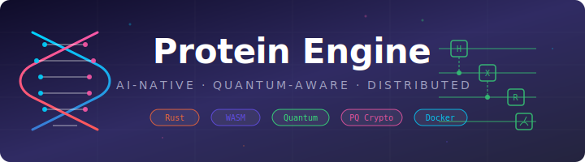

<p align="center">
  
</p>

<h1 align="center">Protein Engine</h1>

<p align="center">
  <strong>AI-native, quantum-aware protein engineering platform</strong><br/>
  <sub>Feed it sequences. It finds better ones.</sub>
</p>

<p align="center">
  <a href="https://github.com/globalbusinessadvisors/Protein-Engine/actions/workflows/ci.yml">
    
  </a>
  <a href="https://github.com/globalbusinessadvisors/Protein-Engine/blob/main/LICENSE">
    
  </a>
  
  
  
  
</p>

<p align="center">
  <a href="#quickstart">Quickstart</a> &middot;
  <a href="#architecture">Architecture</a> &middot;
  <a href="#deployment">Deployment</a> &middot;
  <a href="#development">Development</a> &middot;
  <a href="#mcp-integration">MCP Integration</a>
</p>

---

Protein Engine is a computational protein design platform written in Rust. You give it amino acid sequences and it finds better ones through iterative optimization — scoring candidates with neural networks, evolving populations with genetic algorithms, validating stability with quantum chemistry, and logging every mutation to a tamper-proof ledger. The best variants from each generation seed the next cycle until you have candidates worth taking to the wet lab.

It implements the **SAFLA (Self-Amplifying Feedback Loop Architecture)** closed loop across a modular 16-crate Rust workspace, and compiles to a native CLI, a Docker stack, a browser-ready WASM module, and an MCP server for Claude Code — all from the same codebase.

## What It Does

**In plain terms:** you give it protein sequences, it tells you which ones are most likely to work and iteratively breeds better ones.

**Under the hood:**

- **Neural scoring** — Candle-backed transformer embeddings score sequences across four fitness dimensions: reprogramming efficiency, expression stability, structural plausibility, and safety. A cosine-similarity vector store enables nearest-neighbor search against previously scored variants.
- **Evolutionary optimization** — A configurable genetic algorithm runs tournament selection, single-point crossover, and point mutation across populations of protein variants. Top performers survive; the rest are replaced.
- **Quantum simulation** — VQE (Variational Quantum Eigensolver) estimates molecular ground-state energy to confirm physical stability. QAOA (Quantum Approximate Optimization Algorithm) handles combinatorial optimization. Local Rust solvers run natively; a Python sidecar bridges to pyChemiQ for real quantum hardware.
- **Safety governance** — Rule-based policies enforce fitness and safety thresholds. Variants that don't meet the bar are rejected before promotion, not after.
- **Post-quantum audit trail** — Every mutation is cryptographically signed with ML-DSA-65 (FIPS 204), hash-chained with SHA-3, and serialized to tamper-evident journal segments. If anyone alters a record, the chain breaks.
- **Universal packaging** — RVF (Ruvector File) bundles the binary, WASM module, manifest, ledger, and governance config into a single deployable artifact with integrity verification.
- **Cross-platform** — Runs on x86_64, aarch64 (Raspberry Pi), browsers (WASM), and Docker. Same codebase, different compile targets.

## Architecture

```
┌──────────────────────────────────────────────────────────────────────┐
│                        Presentation Layer                            │
│  pe-cli (terminal)  ·  pe-wasm (browser)  ·  pe-api (HTTP/REST)     │
├──────────────────────────────────────────────────────────────────────┤
│                       Orchestration Layer                             │
│       pe-stream (event bus)  ·  pe-solver (SAFLA coordinator)        │
├──────────────────────────────────────────────────────────────────────┤
│                        Intelligence Layer                            │
│  pe-neural (embeddings)  ·  pe-swarm (evolution)  ·  pe-vector (ANN) │
├──────────────────────────────────────────────────────────────────────┤
│                         Simulation Layer                             │
│      pe-quantum (VQE/QAOA)  ·  pe-chemistry (sidecar bridge)        │
├──────────────────────────────────────────────────────────────────────┤
│                           Trust Layer                                │
│   pe-ledger (hash chain + ML-DSA-65)  ·  pe-governance (policies)   │
├──────────────────────────────────────────────────────────────────────┤
│                         Packaging Layer                              │
│                     pe-rvf (Ruvector File)                           │
├──────────────────────────────────────────────────────────────────────┤
│                        Foundation Layer                              │
│    pe-core (types, traits, amino acid codec, fitness functions)      │
└──────────────────────────────────────────────────────────────────────┘
```

### Crate Map

| Crate | Layer | Description |
|---|---|---|
| `pe-core` | Foundation | Shared types, traits, amino acid codec, fitness scoring |
| `pe-vector` | Intelligence | In-memory vector store with cosine-similarity search |
| `pe-neural` | Intelligence | Candle transformer embeddings (native) / stub (WASM) |
| `pe-swarm` | Intelligence | Genetic algorithm: selection, crossover, mutation |
| `pe-quantum` | Simulation | VQE and QAOA quantum circuit solvers |
| `pe-quantum-wasm` | Simulation | WASM-compatible quantum solver (no native deps) |
| `pe-chemistry` | Simulation | HTTP bridge to pyChemiQ sidecar |
| `pe-ledger` | Trust | Post-quantum signed hash chain with journal segments |
| `pe-governance` | Trust | Policy engine for safety and fitness gates |
| `pe-stream` | Orchestration | Async event bus for pipeline stages |
| `pe-solver` | Orchestration | SAFLA coordinator — wires the full closed loop |
| `pe-rvf` | Packaging | Ruvector File builder/reader with segment types |
| `pe-api` | Presentation | Axum HTTP server with REST endpoints |
| `pe-wasm` | Presentation | wasm-bindgen exports for browser use |
| `pe-cli` | Presentation | Clap CLI — score, evolve, search, quantum, ledger, rvf |

## Quickstart

### Prerequisites

- Rust 1.75+ with `cargo`
- Python 3.11+ (for chemiq sidecar tests)
- Docker & Docker Compose (optional, for containerized deployment)
- Node.js 18+ (optional, for WASM and MCP)

### Build and Run

```bash
# Clone
git clone https://github.com/globalbusinessadvisors/Protein-Engine.git
cd Protein-Engine

# Build native binary
make build

# Score a protein sequence
cargo run --features native --bin protein-engine -- score MKWVTFISLLLLFSSAYS

# Score with JSON output
cargo run --features native --bin protein-engine -- --json score MKWVTFISLLLLFSSAYS

# Run evolutionary optimization
cargo run --features native --bin protein-engine -- evolve --generations 10 --population-size 50

# Quantum VQE simulation
cargo run --features native --bin protein-engine -- quantum vqe H2

# Verify ledger integrity
cargo run --features native --bin protein-engine -- --json ledger verify

# Start HTTP server
make serve
```

### Docker

```bash
# Production stack (protein-engine + chemiq sidecar)
make docker

# Dev stack with hot reload
make docker-dev

# Endpoints
curl http://localhost:8080/health    # API server
curl http://localhost:8100/health    # ChemiQ sidecar
```

## Deployment

### Native Binary

```bash
make release
./target/release/protein-engine serve
```

### Docker Compose

```bash
docker compose up --build
```

The production stack runs two containers:

| Service | Port | Description |
|---|---|---|
| `protein-engine` | 8080 | Rust API server |
| `chemiq-sidecar` | 8100 | Python quantum chemistry bridge |

### WASM (Browser)

```bash
make wasm                    # Build WASM package to web/pkg/
cd web && npm run dev        # Start Vite dev server
```

### RVF Artifact

```bash
make rvf                     # Build universal deployment artifact
cargo run --features native --bin protein-engine -- rvf inspect protein-engine.rvf
```

### Cross-Compilation (aarch64 / Raspberry Pi)

```bash
cargo install cross --locked
cross build --target aarch64-unknown-linux-gnu --features native
```

## MCP Integration

Protein Engine ships an MCP (Model Context Protocol) server that exposes 7 tools to Claude Code:

| Tool | Description |
|---|---|
| `score_sequence` | Score a protein sequence for fitness metrics |
| `evolve` | Run evolutionary optimization over generations |
| `search_similar` | Find similar sequences by embedding distance |
| `quantum_vqe` | Run VQE quantum simulation on a molecule |
| `ledger_verify` | Verify the integrity of the mutation ledger |
| `rvf_inspect` | Inspect an RVF artifact's segments and metadata |
| `create_variant` | Create and score a new protein variant |

### Setup

```bash
cd mcp && npm install && npm run build
```

Add to your Claude Code MCP config:

```json
{
  "mcpServers": {
    "protein-engine": {
      "command": "node",
      "args": ["mcp/dist/server.js", "--mode", "cli", "--bin", "./target/release/protein-engine"]
    }
  }
}
```

## Development

### Common Commands

```bash
make help              # Show all targets

make test              # Run all tests (native)
make test-unit         # Unit tests only
make test-integration  # Integration tests (26 cross-crate tests)
make test-sidecar      # Python sidecar tests

make fmt               # Check formatting
make clippy            # Run lints

make e2e               # E2E CLI smoke tests
make e2e-docker        # E2E Docker stack tests
make e2e-wasm          # E2E WASM tests (Node.js)

make clean             # Remove build artifacts
```

### Project Structure

```
Protein-Engine/
├── crates/                    # 16 Rust workspace crates
│   ├── pe-core/               #   Foundation types, traits, amino acid codec
│   ├── pe-vector/             #   In-memory vector store, cosine similarity
│   ├── pe-neural/             #   Candle transformer embeddings
│   ├── pe-swarm/              #   Genetic algorithm engine
│   ├── pe-quantum/            #   VQE/QAOA quantum solvers (native)
│   ├── pe-quantum-wasm/       #   WASM-compatible quantum solver
│   ├── pe-chemistry/          #   pyChemiQ sidecar HTTP bridge
│   ├── pe-ledger/             #   Post-quantum signed hash chain
│   ├── pe-governance/         #   Policy engine for safety gates
│   ├── pe-stream/             #   Async event bus
│   ├── pe-solver/             #   SAFLA closed-loop coordinator
│   ├── pe-rvf/                #   Ruvector File builder/reader
│   ├── pe-api/                #   Axum HTTP server
│   ├── pe-wasm/               #   wasm-bindgen browser exports
│   ├── pe-cli/                #   Clap CLI binary
│   └── pe-integration-tests/  #   Cross-crate integration tests
├── services/
│   └── chemiq-sidecar/        # Python quantum chemistry bridge
├── docker/                    # Dockerfiles
├── web/                       # Vite + TypeScript frontend
├── mcp/                       # MCP server for Claude Code
├── tests/e2e/                 # E2E smoke tests
├── docs/                      # Documentation and assets
├── docker-compose.yml         # Production stack
├── docker-compose.dev.yml     # Dev stack with hot reload
├── Makefile                   # Build automation
└── .github/workflows/         # CI/CD pipelines
```

### CI Pipeline

The CI runs 11 jobs on every push and pull request:

| Job | Description |
|---|---|
| Format | `cargo fmt --check` |
| Clippy | Lint with `-D warnings` |
| Test (native) | Full test suite with native features |
| Test (WASM) | pe-core and pe-quantum-wasm on wasm32 target |
| Build WASM | wasm-pack build + bundle size check (< 10 MB) |
| Cross-compile | aarch64-unknown-linux-gnu via `cross` |
| Build RVF | Assemble and validate RVF artifact |
| Docker | Build and smoke test the container stack |
| Sidecar tests | Python pytest suite for chemiq-sidecar |
| E2E CLI | 19-assertion CLI smoke test |
| E2E Docker | Full stack E2E with endpoint verification |

### Feature Flags

| Flag | Effect |
|---|---|
| `native` | Enables Candle ML inference, pqcrypto ML-DSA-65, Tokio async runtime |
| `wasm` | Enables wasm-bindgen exports, browser-compatible quantum solver |

## How the Optimization Loop Works

Each generation runs through six stages. The output feeds back into the next cycle — better variants in, better variants out.

```
  ┌─── Design ◄──────────────────────────────────────────┐
  │       │                                               │
  │       │  Generate or mutate candidate sequences       │
  │       ▼                                               │
  │     Score ─── pe-neural, pe-vector                    │
  │       │       Transformer embeddings → fitness on     │
  │       │       4 dimensions; store in vector index     │
  │       ▼                                               │
  │   Validate ── pe-quantum, pe-chemistry                │
  │       │       VQE/QAOA confirm the molecule is        │
  │       │       physically stable                       │
  │       ▼                                               │
  │    Screen ─── pe-governance                           │
  │       │       Policy engine checks safety and         │
  │       │       fitness thresholds                      │
  │       ▼                                               │
  │      Log ──── pe-ledger                               │
  │       │       ML-DSA-65 signature → SHA-3 hash        │
  │       │       chain → journal segment                 │
  │       ▼                                               │
  │   Promote ─── pe-swarm, pe-solver                     │
  │               Top variants seed next generation;      │
  └───────────────── SAFLA coordinator loops back ────────┘
```

After enough generations, the top-scoring variants that pass all gates are your candidates for wet-lab synthesis. The ledger provides a cryptographically verifiable audit trail of every mutation that was tried, scored, and either promoted or rejected.

## License

[MIT](LICENSE)

## Authors

- **Nick** — [nick@nicholasruest.com](mailto:nick@nicholasruest.com)
- **rUv** — [ruv@ruv.io](mailto:ruv@ruv.io)
